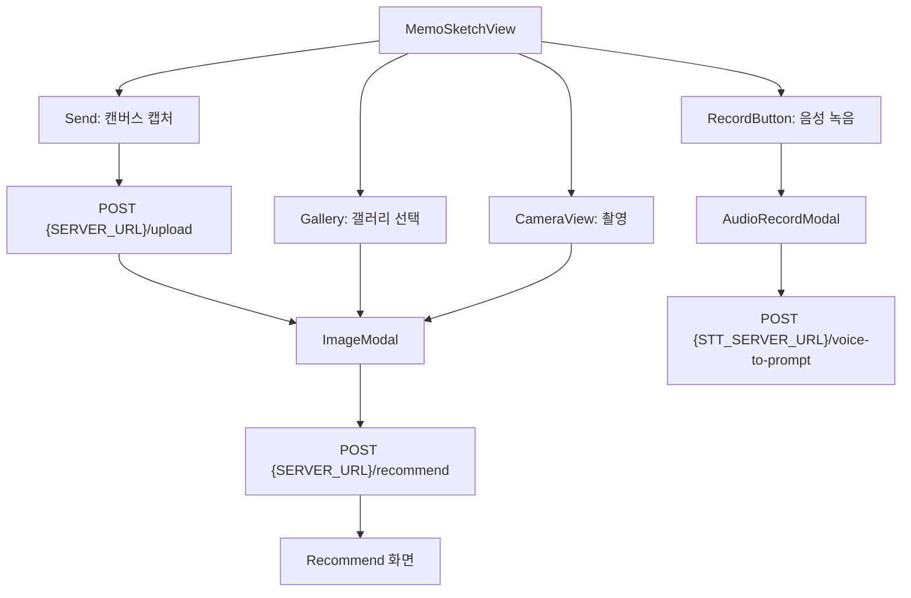

## 프로젝트 개요

Expo(React Native) 기반 메모·스케치 앱입니다. 캔버스에 그린 스케치를 서버로 업로드하고, 카메라·갤러리 이미지로 상품 추천을 받거나, 음성 녹음을 STT 서버로 보내 텍스트·프롬프트를 받는 흐름을 포함합니다.

## 사전 요구사항

- Node.js 18+
- [pnpm](https://pnpm.io/)
- Expo Go 또는 development build (`expo-dev-client`)

```bash
pnpm install
pnpm start          # 또는 pnpm expo start --offline (웹/Metro 이슈 시)
```

## 실행방법

**web**

- 온라인 모드가 잘 안될 경우:

```bash
pnpm expo start --offline
```

- 터미널에서 `w` 키로 웹 실행

```text
› Press a │ open Android
› Press w │ open web
```

## 사용자 흐름



## 아키텍처 요약

| 영역 | 주요 코드 | 역할 |
|------|-----------|------|
| 네비게이션 | `src/App.tsx` | `AudioStorageProvider`로 앱 전체 감싼 뒤 `MemoSketchView` → `Recommend` 스택 |
| 스케치·업로드 | `src/components/MemoSketch.tsx`, `src/managers/SketchUploader.ts` | `DrawingCanvas` 캡처 → base64 → `POST {SERVER_URL}/upload` → 응답 `image`로 `ImageModal` |
| 추천 | `src/components/ImageModal.tsx` | `POST {SERVER_URL}/recommend` 후 `RecommendView`로 이동 |
| 카메라 | `src/components/CameraView.tsx` | 촬영 URI를 base64로 읽어 `PickedAsset` 구성 후 `ImageModal` |
| 음성 | `src/components/RecordButton.tsx`, `src/components/AudioRecordModal.tsx` | `expo-audio` 녹음 → `AudioStorageService.saveRecording` |
| 음성 DI | `src/services/AudioStorageContext.tsx` | `useAudioStorage()` 훅, 테스트용 `service` prop 주입 가능 |

`MemoSketch`의 `uploadUrl` prop은 `App.tsx`에서 `'set your ip'`로 넘기지만, 실제 업로드 URL은 `MemoSketch` 내부에서 `SERVER_URL` 환경변수로 조합합니다.

### DrawingCanvas 캡처

`DrawingCanvas`(`react-native-view-shot`)는 `capture()`로 PNG 파일 URI를 반환합니다. `MemoSketch.handleSend`는 `expo-file-system`으로 base64로 변환한 뒤 `SketchUploader.uploadPngBase64`에 넘깁니다.

### 음성 녹음 UI 상태

`AudioRecordModal`은 ref로 `open()` / `close()`를 노출합니다.

1. **녹음 중**: 일시정지·재개, 취소(삭제), 완료(정지 후 URI 저장)
2. **완료 후**: 재생 미리보기, 저장(STT 업로드) 또는 취소

저장 시 `AudioStorageService.saveRecording(uri)`를 호출합니다. 응답의 `prompt_en`, `stt_text`는 현재 `console.log`만 하며, 스케치 텍스트 입력란에는 아직 연결되지 않습니다.

## 환경변수 설정

프로젝트 루트에 `.env` 파일을 만들고, `babel.config.js`의 `react-native-dotenv` 설정(`moduleName: '@env'`, `path: '.env'`)에 맞게 값을 넣습니다. 템플릿은 [`.env.example`](./.env.example)을 참고하세요.

```text
SERVER_URL=http://{호스트IP}:{포트}
STT_SERVER_URL=http://{STT호스트IP}:{포트}
```

| 변수 | 사용처 |
|------|--------|
| `SERVER_URL` | `{SERVER_URL}/upload` (스케치), `{SERVER_URL}/recommend` (추천) |
| `STT_SERVER_URL` | `{STT_SERVER_URL}/voice-to-prompt` (음성) |

실기기·에뮬레이터에서 접근 가능한 LAN IP를 사용하세요. `.env` 변경 후 Metro를 재시작해야 반영됩니다.

## 서버 API 계약 (클라이언트 기준)

### 스케치·추천 (`SketchUploader.uploadPngBase64`)

공통: `POST`, `multipart/form-data`

| 엔드포인트 | multipart 필드 | 추가 필드 |
|------------|----------------|-----------|
| `/upload` | `sketch` (PNG) | `prompt` (텍스트, 기본값 `"realistic image"`) |
| `/recommend` | `image` (PNG) | `prompt` |

- **업로드 응답** (`/upload`): JSON `{ "image": string }` — `image`로 `PickedAsset`을 채운 뒤 `ImageModal` 표시
- **추천 응답** (`/recommend`): `RecommendResponse` (`src/types/recommend.ts`) — `status`, `prompt`, `image_url`, `results[]`

`SketchUploader`는 base64 문자열 앞의 `data:image/png;base64,` 접두사가 있으면 제거한 뒤 업로드합니다.

### 음성 STT (`AudioStorageService`)

- **메서드·경로**: `POST /voice-to-prompt`
- **본문**: `file` 필드, `audio/m4a`, 파일명 `reording.m4a` (구현상 오타 그대로)
- **응답**: JSON `{ "prompt_en": string, "stt_text": string }` (필드명은 `AudioRecordModal.onSaveHandler`와 일치해야 함)

## 권한

| 기능 | 요청 위치 |
|------|-----------|
| 마이크 | `AudioRecordModal` — `AudioModule.requestRecordingPermissionsAsync()` |
| 카메라 | `CameraView` — `ImagePicker.requestCameraPermissionsAsync()` |
| 갤러리 저장 | `MemoSketch.handleSaveToGallery` — `MediaLibrary` |

## 트러블슈팅

- **`useAudioStorage는 AudioStorageProvider 안에서…`**: `App.tsx`처럼 `AudioStorageProvider`로 트리를 감싸야 합니다. 단위 테스트는 `<AudioStorageProvider service={mock}>`로 대체 구현을 주입할 수 있습니다.
- **환경변수 미반영**: `.env` 수정 후 `pnpm start`를 다시 실행합니다.
- **STT만 실패**: `STT_SERVER_URL` 설정, 실기기에서 STT 호스트 도달 여부, CORS(웹)를 확인합니다.
- **업로드/추천 실패**: `SERVER_URL`이 올바른지, 서버가 위 multipart 필드명(`sketch` / `image`)을 받는지 확인합니다.
- **녹음 저장 시 URI 오류**: 완료(체크)로 녹음을 정지한 뒤 저장해야 `uri`가 설정됩니다.
